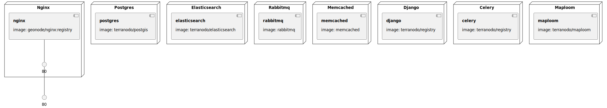

# Hypermap Registry

Hypermap Registry is a platform that manages OWS, Esri REST, and other types of map service harvesting, and orchestration and maintains uptime statistics for services and layers.

Check [Hypermap Registry documentation](http://cga-harvard.github.io/Hypermap-Registry/)

### Infrastructure model

- [django component model](.infragenie/django_component_model.svg)

---
